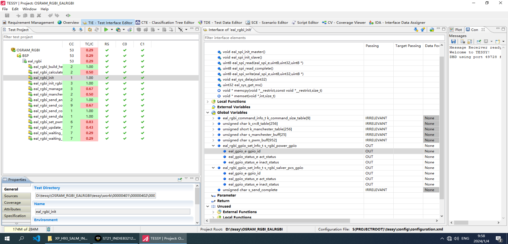
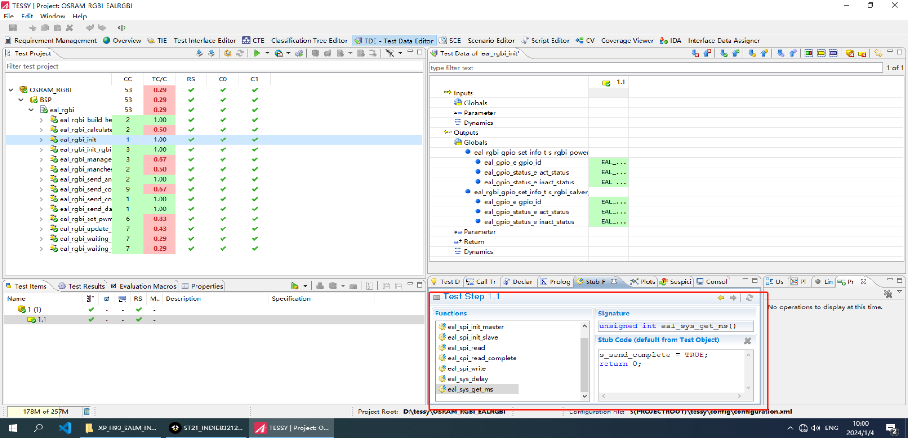

# gograce
## 项目架构图

## 效果参考 C-tessy

## Development Plan
### V1.0
####  Backend
- [x] 实现源文件AST分析
- [ ] 聚合YAML测试配置文件和AST树
- [ ] 聚合测试配置后生成前端显示数据
- [ ] CMD初始化可视化界面, 参数化启动
- [ ] 测试配置修改
- [ ] 根据聚合后的测试配置生成`.SOURCE_FILE_test.go`文件
- [ ] 执行单元测试(All / Current)
- [ ] ~~监控源文件变化~~(暂时采用手动测试)
- [ ] ~~测试用例不匹配项设置暂存区~~(配置与AST不匹配时, 在下一次同步配置到YAML中时, 自动忽略)
- [ ] 测试结果生成与导出

#### Frontend
- [ ] 根据现有测试信息进行显示
- [ ] 选择是否忽略文件或者函数, 并添加忽略备注
- [ ] ~~测试用例分组~~(暂时不支持, 需要求函数功能单一, 且颗粒度足够细)
- [ ] 新增测试用例
- [ ] 编辑测试用例
- [ ] 变量/函数打桩(暂时不支持Mock)
- [ ] 测试结果展示与导出

